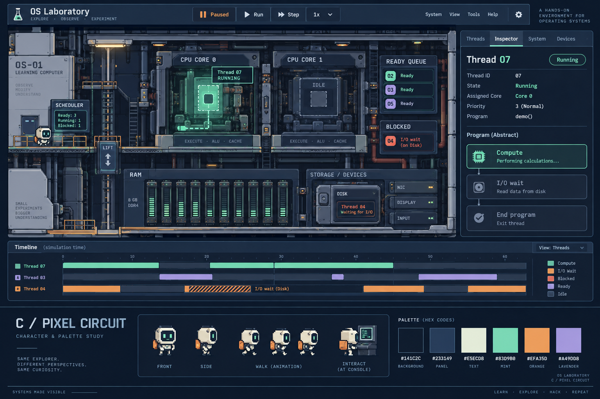
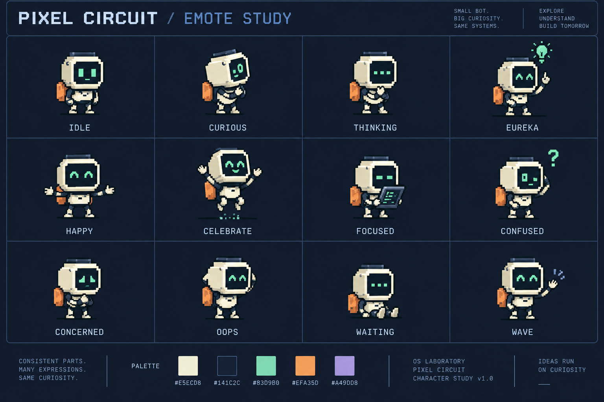
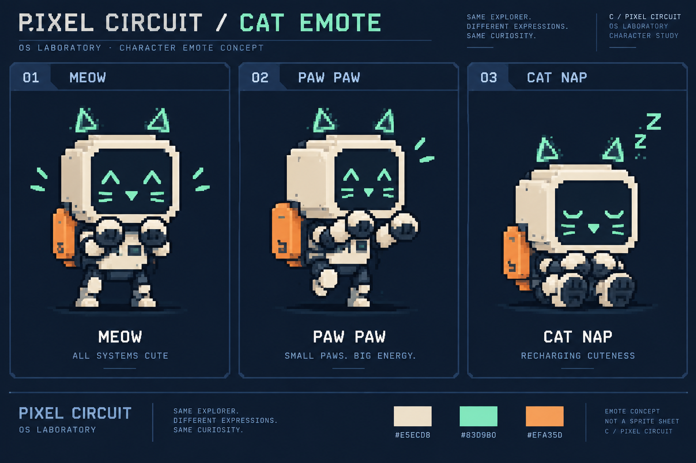

# OS Laboratory

An explorable operating-systems laboratory for advanced learning.

M0 foundation implementation is in progress. No playable laboratory or performance result is available yet.

- [Product and technical spec](OS-Laboratory-Spec.md)
- [Implementation backlog](IMPLEMENTATION-TODO.md)
- [Repository workflow](CONTRIBUTING.md)
- [Agent operating rules](AGENTS.md)
- [Current handoff](docs/HANDOFF.md)
- [Character design](visual-design/CHARACTER-EMOTES.md)
- [Cat emotes](visual-design/CAT-EMOTE.md)

## Approved direction: Pixel Circuit

Concept images establish visual direction; illustrative labels and timelines do not override simulation contracts.
